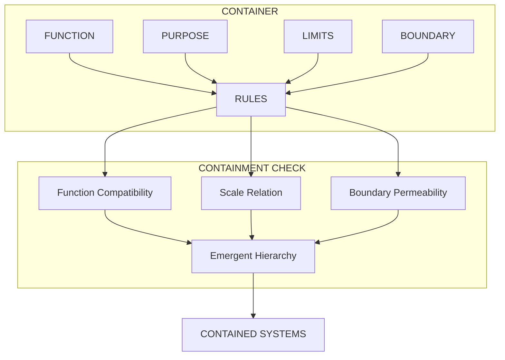
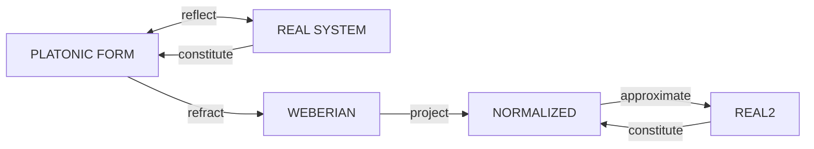
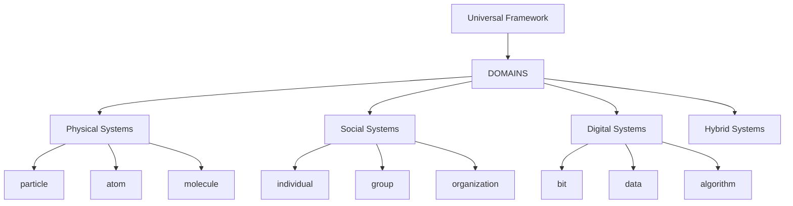

# Plan: Living Container Framework

## Overview

A generalized system for organizing hierarchically nested containers where the hierarchy emerges from the contained systems themselves, not predetermined levels. The framework provides rules for containment, interaction, and idealized form reflection/refraction.

---

## Part I: Universal Rules (Not Predetermined Structure)

### 1.1 Container Contract

Every container must define:

| Attribute | Description |
|-----------|-------------|
| **FUNCTION** | What the container enables/produces |
| **PURPOSE** | Why the container exists |
| **LIMITS** | What the container cannot do (by design) |
| **BOUNDARY** | Permeability type (porous, semi-permeable, sealed) |

### 1.2 Containment Rules (Multi-Factor)

A system X can contain system Y when ALL of:

1. **Function Compatibility**: X's function can accommodate Y's function
2. **Scale Relation**: Y fits within X's scale range (min/max)
3. **Boundary Permeability**: X's boundary permits Y to exist

**Precedence**: Context-dependent - sometimes function dominates, sometimes scale, sometimes boundary.

### 1.3 Primitive Definition

Primitives are **unspecified** - each instantiation defines its own smallest unit:

- Physical domain: atom, particle, field quantum
- Informational domain: bit, concept, signal
- Social domain: individual, role, norm
- Leave undefined: let instantiation decide

### 1.4 Top Boundary (Self-Defining)

The ultimate container is **self-defining**: the question "what contains everything?" is itself the boundary that defines the container.

---

## Part II: Idealized Forms (Co-Constitutive)

### 2.1 Triad of Idealization

| Form | Relationship to Real |
|------|----------------------|
| **PLATONIC** | Perfect archetype (the ideal triangle) |
| **WEBERIAN** | Essential function captured (bureaucracy ideal type) |
| **NORMALIZED** | Representation of real instances |

### 2.2 Reflection/Refraction Dynamics

```
IDEAL <---> REAL (co-constitutive)
   ↑          ↑
   +--- reflect (mirror)
   +--- refract (bend/distort)
   +--- project (map between levels)
   +--- approximate
```

- Ideal forms don't just mirror reality
- They co-constitute each other
- Each instantiation chooses its own ideal/real relation

---

## Part III: Interaction Emergence

### 3.1 Interaction Modes (Not Predetermined)

Interactions **emerge** from specific system relations - no fixed set:

- Emergence principle: interactions are determined by what the systems ARE, not by predefined categories
- All interactions are possible implementations (but context filters)

### 3.2 Interaction Detection

```
For systems A and B:
  1. Identify A's and B's functions
  2. Identify A's and B's boundaries
  3. Check containment compatibility
  4. Emergent interactions result
```

---

## Part IV: Framework Family

### 4.1 Universal Base

```
LIVING_CONTAINER_FRAMEWORK
├── RULES: containment, interaction, idealization
├── TEMPLATES: for domain instantiation
└── CONFIG: env vars for customization
```

### 4.2 Domain Instantiations

| Domain Family | Example Containers |
|---------------|---------------------|
| **PHYSICAL** | particle → atom → molecule → cell → organism → ecosystem |
| **SOCIAL** | individual → group → organization → institution → society |
| **DIGITAL** | bit → byte → data structure → algorithm → system |
| **HYBRID** | (any combination) |

### 4.3 Instantiation Pattern

```python
# Each domain creates its own hierarchy
# Rules are universal, levels are emergent

class Container:
    function: str      # what it enables
    purpose: str      # why it exists
    limits: set       # what it cannot do
    boundary: str     # permeability
    contains: list   # emergent from rules, not preset
```

---

## Part V: Environment Template

```bash
# .env.template - Copy to .env and customize

# === CONTAINER ATTRIBUTES ===
CONTAINER_FUNCTION=function
CONTAINER_PURPOSE=purpose
CONTAINER_LIMITS=limits
CONTAINER_BOUNDARY=boundary

# === CONTAINMENT RULES ===
CONTAINMENT_FUNCTION_WEIGHT=0.4
CONTAINMENT_SCALE_WEIGHT=0.3
CONTAINMENT_BOUNDARY_WEIGHT=0.3
CONTAINMENT_PRECEDENCE=context_dependent

# === IDEALIZED FORMS ===
IDEAL_PLATONIC=platonic
IDEAL_WEBERIAN=weberian
IDEAL_NORMALIZED=normalized

# === DOMAIN CONFIG ===
DOMAIN_FAMILY=physical  # physical, social, digital, hybrid
PRIMITIVE_TYPE=unspecified  # atom, bit, role, unspecified

# === HIERARCHY EMERGENCE ===
LEVEL_NAMES_EMERGE=true  # levels named by function, not preset
AUTO_CONTAINMENT_CHECK=true
```

---

## Part VI: Diagrammatic Representation

### 6.1 Container Rule Flow



### 6.2 Ideal/Real Co-Constitution



### 6.3 Framework Family



---

## Part VII: Open Questions

For your input:

1. **Containment transitivity**: If A contains B and B contains C, does A necessarily contain C? (Depends on boundary permeability)
2. **Primitive identity**: Do primitives from dissolved containers persist elsewhere?
3. **Hierarchy depth**: Is there a minimum or maximum number of levels?
4. **Cross-domain containment**: Can a digital system contain a social system?
5. **Ideal form dominance**: In co-constitution, which form leads?

---

## Deliverables Summary

| Part | Output |
|------|--------|
| I | Universal rules (7 sections) |
| II | Idealized forms theory |
| III | Interaction emergence |
| IV | Framework family structure |
| V | .env.template |
| VI | Mermaid diagrams |
| VII | Open questions |

---

*Plan: 2026-04-03-living-container-framework*
